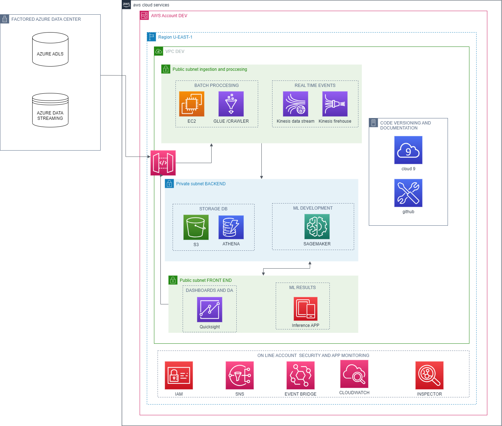

# Factored Datathon 2023
This is the repo that will contain all the development regarding the competition.

## High-Level Cloud Architecture

## Naming Code for Cloud Resources
The main rules to name different cloud resources can be found in `utils/Guideline for Naming Conventions Datathon.pdf`

## Colaboratory Policy
- The main and dev branches are protected via reviewed PR's.
- Time window to commit to GitHub 19:30 EST - 21:30 EST

## License
[MIT](https://choosealicense.com/licenses/mit/)
